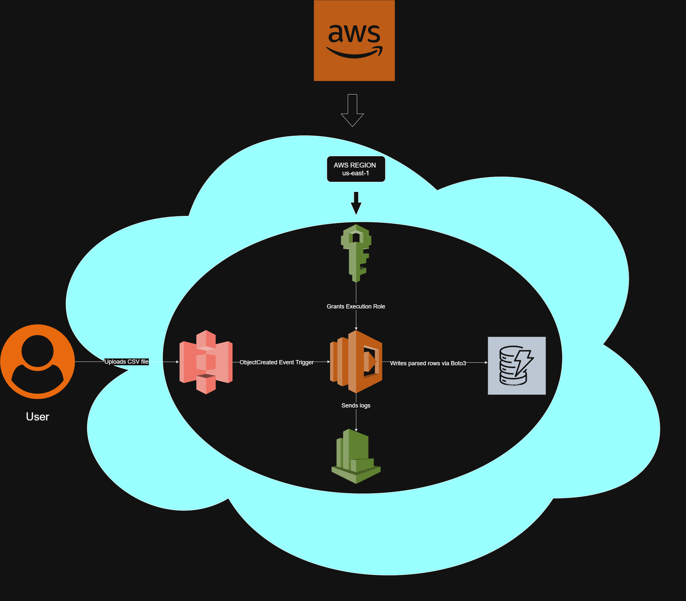

# ameenmohammed-finalproject-2026

## Project Summary
This project is an automated, serverless data pipeline built on AWS. It lets you upload CSV files that contain student grades, which are processed and kept in a database.

**Problem I Solved:** Educational institutions often rely on manual data entry for student records. This project allows for the automated processing and upload of student grade information, while keeping the costs very low if not $0, by utlizing AWS Free Tier

## Tech Info
* **Compute:** AWS Lambda (Language: Python)
* **Storage:** Amazon S3
* **Database:** Amazon DynamoDB
* **Security:** AWS Identity and Access Management (Least-Privilege Execution Roles)
* **Monitoring:** Amazon CloudWatch

## Architecture Diagram/Guide

## Setup Instructions
To replicate this environment in your own AWS account:

1. **DynamoDB:** Create a table named `StudentGrades` with a Partition Key of `student_id` (String).
2. **S3 Bucket:** Create a standard S3 bucket with any name you want and block all public access to keep it secure.
3. **IAM Role:** Create a Lambda execution role with `AmazonS3ReadOnlyAccess` and `AmazonDynamoDBFullAccess` attached.
4. **Lambda Function:** Create a Python 3.12 Lambda function, assign the IAM role, and upload the `lambda_function.py` code located in the `/src` directory of this repository.
5. **Trigger:** Configure an S3 Event Notification on your bucket to trigger the Lambda function upon the creation of `.csv` objects.

## Cloud Engineering Best Practices Applied
* **Cost Optimization:** Using this event driven bill method, I ensure that there are no running costs. You are only billed for the exact moment the python code runs. Making this a very cost effective solution.
* **Security:** Public access is blocked on S3, and the Lambda function operates under a strict IAM execution role.
